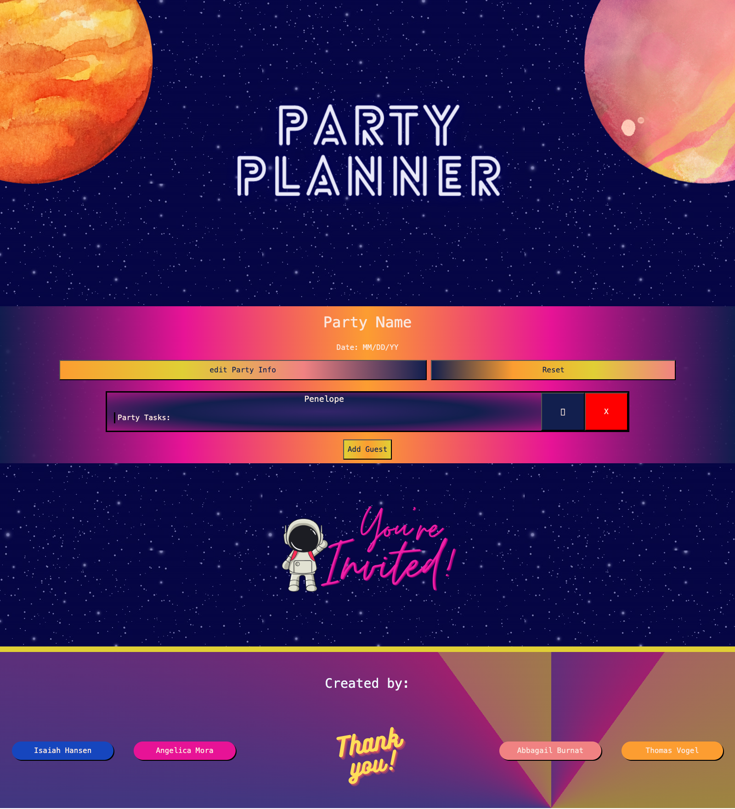
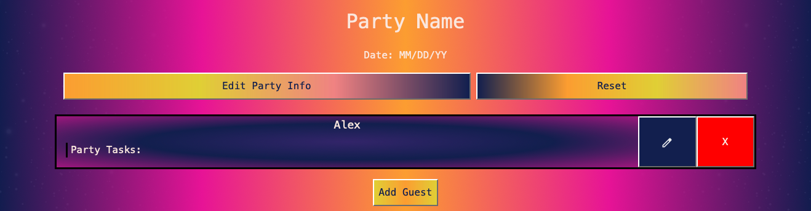
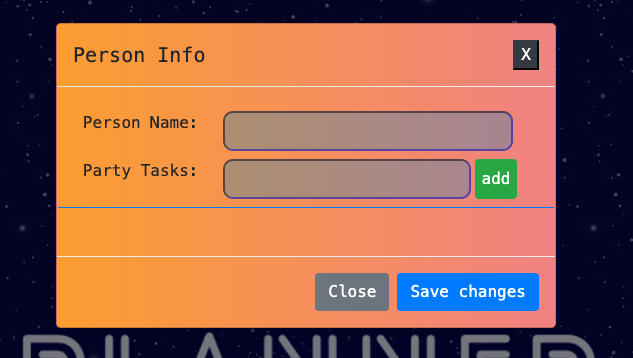
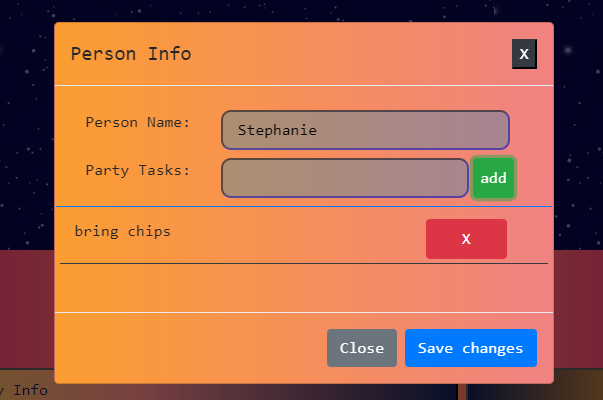
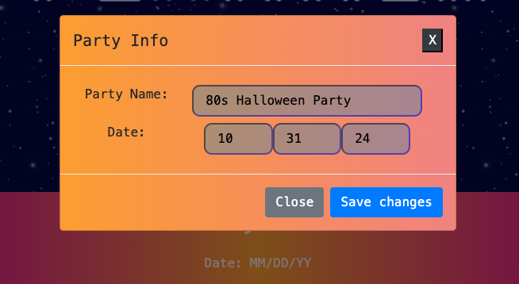
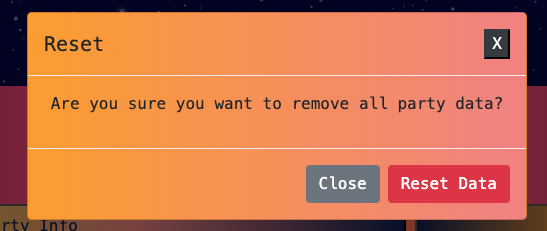

# Party-Planner-Project1

## Description

Bootcamp Project 1 - Party Planner Site

Motivation:
Love hosting but hate the logistics? This tool is for you! Our Party Planner site puts everything in one place. Simple UI to create guest lists, assign tasks, and store details. Your progress is always saved. Perfect for on-the-go planning.

Our Simple Solution:
Party planning should be fun and not stressful. The Party Planner site lets you manage your guest lists, assign party tasks (e.i. bringing chips and drinks), and store details all in one place. Just one platform to save time and be organized so you can enjoy your party, and cry if you want to.

Tips:
We wanted a simple experience for busy people. We learned to build a platform that’s simple, responsive for mobile-use, and can handle any size of party. 

## Installation

1. Clone the repository

2. Navigate to the project directory - https://github.com/angiethelibrarian/Party-Planner-Project1

3. Access the website: (https://angiethelibrarian.github.io/Party-Planner-Project1/)

### Landing Page

* This is the landing page view

## Credits

Collaborators
1. Isaiah Hansen: https://github.com/KeelerZoroth
2. Angelica Mora: https://github.com/angiethelibrarian
3. Abbagail Burnat: https://github.com/Phypai
4. Thomas Vogel: https://github.com/Thymezz

## Tutorials

* https://coding-boot-camp.github.io/full-stack/github/professional-readme-guide
* https://getbootstrap.com
* https://www.w3schools.com/
* https://getbootstrap.com/
* https://fonts.google.com/selection/embed
* https://www.canva.com/
* https://www.colorzilla.com/gradient-editor/
* https://www.awesomescreenshot.com/

## Features

* Party Planner Guest Structure 

* Modal with Person and Party Task Info added

* Add Person and Party Task Info

* Modal with Person and Party Task Info added

* Modal with Person and Party Task Info added

* Reset Party Data Modal
