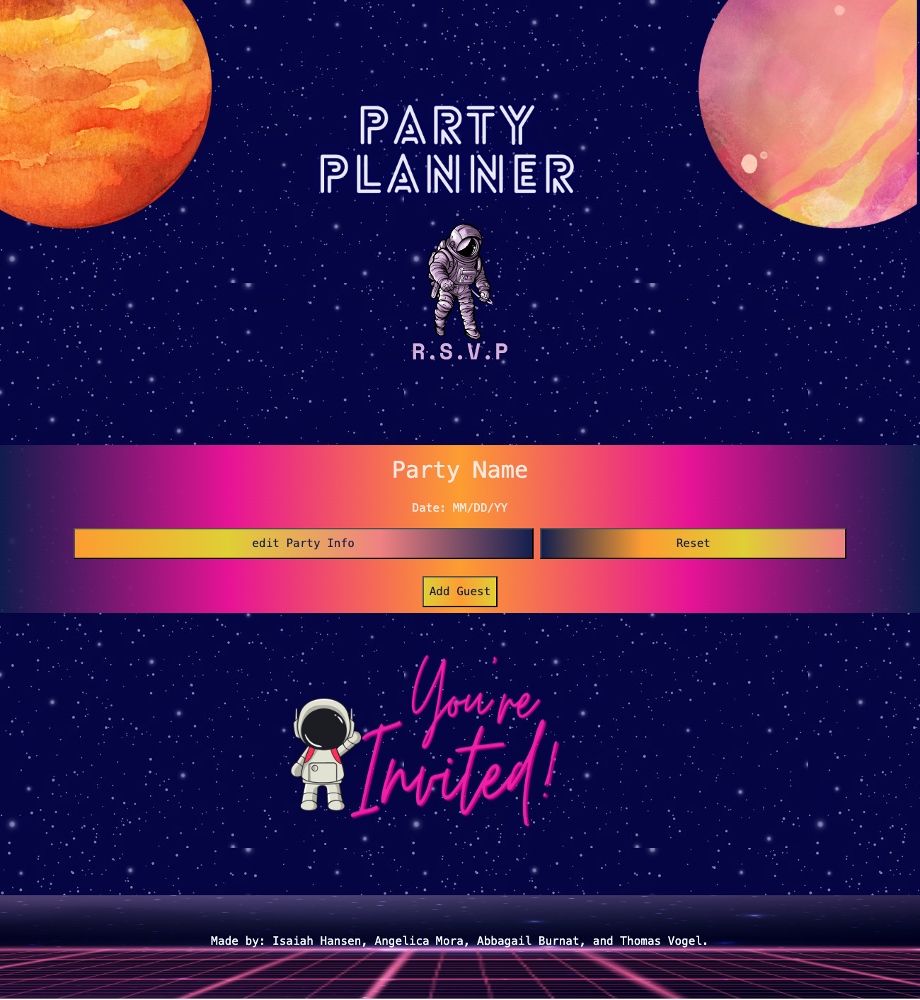

# Party-Planner-Project1

## Description

Bootcamp Project 1 - Party Planner Site

Motivation: 
This project aimed to create an all-in-one platform that relieves the stress of party planning for people who want to host events. Planning can be overwhelming, whether it's a birthday, wedding, or corporate event. This website aims to streamline the process by offering easy-to-use tools and resources for planning any celebration, instilling confidence in users that their event will be a success.

Why This Project: 
We built this project to solve a common problem: the hassle of coordinating various aspects of a party, such as managing guest lists and party supplies. Party Planners provides a comprehensive solution, instilling confidence in users that they can organize all their party details in one place.

Problem Solved: 
The site simplifies event planning by offering features such as guest list management, MVP, all in one platform. This eliminates the need to juggle multiple tools or services, saving users time and allowing them to focus on other aspects of their event. 

Lessons Learned: 
We learned how to integrate multiple services into one cohesive web application throughout the development process. We also gained experience in user experience (UX) design, database management, and ensuring the platform's scalability to handle various event sizes.

## Installation

1. Clone the repository

2. Navigate to the project directory - https://github.com/angiethelibrarian/Party-Planner-Project1

3. Access the website: TBA

## Usage

### Landing Page


* This is the landing page view

Provide instructions and examples for use. Include screenshots as needed.

To add a screenshot, create an `assets/images` folder in your repository and upload your screenshot to it. Then, using the relative filepath, add it to your README using the following syntax:

    ```md
    
    ```

## Credits

Collaborators

1. Isaiah Hansen: https://github.com/KeelerZoroth
2. Angelica Mora: https://github.com/angiethelibrarian
3. Abbigail Burnat: https://github.com/Phypai
4. Thomas Vogel: https://github.com/Thymezz


If you used any third-party assets that require attribution, list the creators with links to their primary web presence in this section.

If you followed tutorials, include links to those here as well.

Tutorials:
* https://coding-boot-camp.github.io/full-stack/github/professional-readme-guide
* https://getbootstrap.com
* https://www.w3schools.com/
* https://getbootstrap.com/
* https://fonts.google.com/selection/embed
* https://www.canva.com/
* https://www.colorzilla.com/gradient-editor/
* https://www.awesomescreenshot.com/

## License


---

🏆 The previous sections are the bare minimum, and your project will ultimately determine the content of this document. You might also want to consider adding the following sections.

## Features

If your project has a lot of features, list them here.

## How to Contribute

If you created an application or package and would like other developers to contribute it, you can include guidelines for how to do so. The [Contributor Covenant](https://www.contributor-covenant.org/) is an industry standard, but you can always write your own if you'd prefer.

## Tests

Go the extra mile and write tests for your application. Then provide examples on how to run them here.